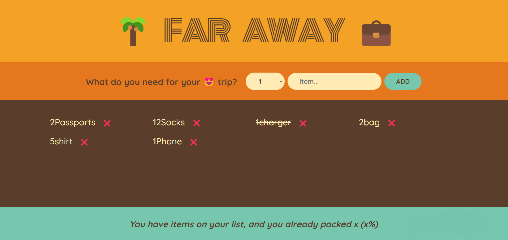

# Far Away 💼

Far Away is a simple web application designed to help users create packing lists for their trips. Users can add items they need to pack, mark them as packed, and track their progress with a handy stats footer.

## Features

- **Add Items**: Users can add items they need to pack using the provided form.
- **View Packing List**: All added items are displayed in a list format.
- **Mark as Packed**: Users can mark items as packed or unpacked by checking them off.
- **Delete Items**: Items can be deleted from the list if they are no longer needed.
- **Stats Footer**: Provides users with a summary of their packing progress, including the total number of items and the percentage of items packed.

## Technologies Used

- **React**: The frontend of Far Away is built using React, a JavaScript library for building user interfaces.
- **JavaScript (ES6+)**: Modern JavaScript syntax is used throughout the project for functionality and interactivity.
- **HTML & CSS**: Used for structuring the webpage and styling the components.
- **Markdown**: This README is written in Markdown format for easy readability.

## Getting Started

To get started with Far Away on your local machine, follow these steps:

1. Clone this repository to your local machine.
2. Navigate to the project directory in your terminal.
3. Run `npm install` to install the project dependencies.
4. Run `npm start` to start the development server.
5. Open your web browser and navigate to `http://localhost:3000` to view the application.

## Contributing

Contributions to Far Away are welcome! If you have any suggestions, bug reports, or feature requests, please open an issue on GitHub or submit a pull request.

---

## OverView

Happy packing! ✈️🌴
